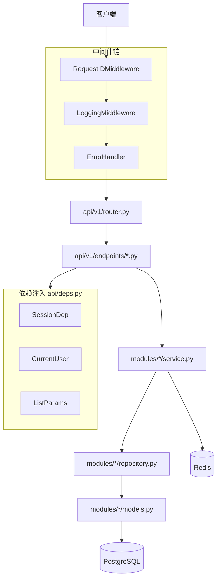
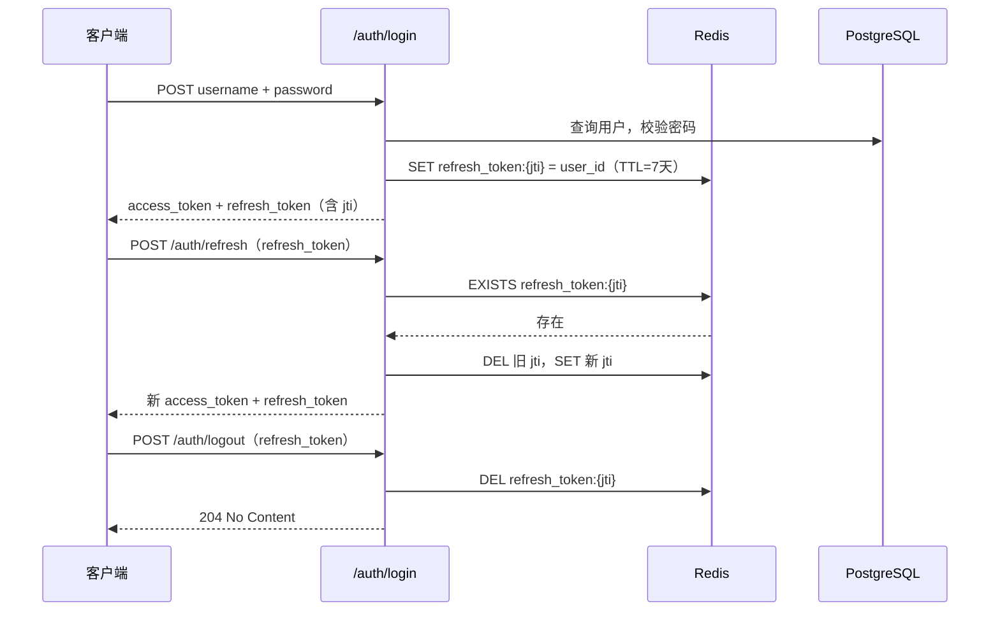

# FastAPI 后端项目模板

基于 **FastAPI + SQLModel + PostgreSQL + Redis + Alembic + uv + Docker** 的生产就绪后端模板，采用按业务模块组织 + 模块内四层分离架构，可直接作为新业务项目底座。

## 核心特性

- 四层分层架构：Endpoint → Service → Repository → Model
- JWT 双 Token 认证（access + refresh），含时序攻击防护
- Refresh Token 可主动撤销（Redis jti 机制），支持安全登出
- Auth 端点频率限制（slowapi + Redis），防暴力破解
- 泛型 Base Repository，内置 CRUD + 软删除 + 分页排序
- 统一异常体系 + 全局错误处理
- 结构化 JSON 日志 + 请求 ID 全链路追踪
- Alembic 数据库迁移管理
- Docker 多阶段构建 + Compose 开发/生产双模式（含 Redis 服务）
- 完善的测试体系（接口层 / 服务层 / 仓储层）

---

## 目录

- [架构设计](#架构设计)
- [快速开始](#快速开始)
- [环境变量说明](#环境变量说明)
- [新模块开发指南](#新模块开发指南)
- [API 接口概览](#api-接口概览)
- [数据库管理](#数据库管理)
- [测试](#测试)
- [Docker 部署](#docker-部署)
- [项目约定](#项目约定)
- [待演进方向](#待演进方向)

---

## 架构设计

### 分层架构



### 目录结构

```text
server-template/
├── app/
│   ├── main.py                  # 应用入口，组装 FastAPI / CORS / 中间件 / 路由 / lifespan
│   ├── api/
│   │   ├── deps.py              # 依赖注入：Session、Token、CurrentUser、分页参数
│   │   ├── docs.py              # OpenAPI 响应模板（401/403/404/409/422）
│   │   └── v1/
│   │       ├── router.py        # v1 路由聚合
│   │       └── endpoints/       # 接口层：auth / users / health
│   ├── core/
│   │   ├── config.py            # 配置管理（pydantic-settings，读取 .env）
│   │   ├── database.py          # 数据库引擎 / Session 生成器 / 健康检查
│   │   ├── limiter.py           # slowapi Limiter 实例（Redis 后端）
│   │   ├── logging.py           # 结构化 JSON 日志 + RequestID 过滤器
│   │   ├── redis.py             # Redis 连接池管理
│   │   ├── security.py          # JWT 编解码（含 jti）/ 密码哈希 / 强度校验
│   │   └── transaction.py       # commit_and_refresh 事务辅助
│   ├── middleware/
│   │   ├── request_id.py        # 生成 UUID 请求 ID，注入响应头
│   │   ├── logging.py           # 记录请求方法 / 路径 / 状态码 / 耗时
│   │   └── error_handler.py     # 全局异常 → JSON 响应
│   ├── models/
│   │   └── base.py              # TableBase：id / created_at / updated_at / deleted_at
│   ├── modules/
│   │   ├── auth/                # 认证模块：登录 / 刷新 / 注册 / 登出 / 解析当前用户
│   │   └── users/               # 用户模块：创建 / 更新 / 列表查询 / 超管创建
│   ├── repositories/
│   │   └── base.py              # 泛型 RepositoryBase[ModelType]
│   ├── schemas/
│   │   └── common.py            # 通用响应模型：Page / Message / ErrorResponse / HealthStatus
│   └── utils/
│       └── exceptions.py        # 异常类层次：AppException 及其子类
├── alembic/                     # 数据库迁移
├── scripts/
│   ├── entrypoint.sh            # 生产启动脚本（迁移 → 初始化 → gunicorn）
│   └── bootstrap_db.py          # 初始化超级管理员
├── tests/                       # 测试套件
├── Dockerfile                   # 生产镜像（多阶段构建）
├── Dockerfile.dev               # 开发镜像（热重载）
├── docker-compose.yml           # Compose 编排（db + redis + dev/prod profile）
├── pyproject.toml               # 项目元数据 + 依赖 + 工具配置
└── .env.example                 # 环境变量模板
```

### 请求处理流程

1. 客户端发起 HTTP 请求
2. `RequestIDMiddleware` 生成 UUID 并写入 `ContextVar`，响应头附带 `X-Request-Id`
3. `LoggingMiddleware` 记录请求方法、路径、状态码、耗时（JSON 格式，含 request_id）
4. `ProxyHeadersMiddleware` 从可信代理解析 `X-Forwarded-For`，设置真实客户端 IP
5. `CORSMiddleware` 处理跨域
5. slowapi `RateLimitExceeded` 处理器对超限请求返回 429
6. 路由匹配至 `api/v1/endpoints/` 下的具体 endpoint
7. endpoint 通过 `deps.py` 注入 Session / CurrentUser / ListParams 等依赖
8. endpoint 调用 `modules/*/service.py` 处理业务逻辑
9. service 调用 `modules/*/repository.py` 执行数据访问，必要时读写 Redis
10. 若出现异常，`error_handler.py` 统一捕获并返回 `{"detail": "..."}` JSON 响应

### 模块关系

| 模块 | 职责 |
|------|------|
| `auth` | 登录认证、Token 签发/刷新/撤销、用户注册、登出、解析当前登录用户 |
| `users` | 用户 CRUD、超管创建、用户列表（仅管理员） |

---

## 快速开始

### 方式一：Docker 开发（推荐）

```bash
# 1. 配置环境变量
cp .env.example .env
# 编辑 .env，至少修改 SECRET_KEY

# 2. 启动数据库 + Redis + 开发服务（热重载）
docker compose --profile dev up -d

# 3. 执行数据库迁移
docker compose exec backend-dev alembic upgrade head

# 4. 初始化超级管理员
docker compose exec backend-dev python scripts/bootstrap_db.py

# 5. 访问 API 文档
open http://localhost:8000/docs
```

### 方式二：本地开发

```bash
# 1. 安装 uv（如未安装）
curl -LsSf https://astral.sh/uv/install.sh | sh

# 2. 安装依赖
uv sync --extra dev

# 3. 配置环境变量
cp .env.example .env

# 4. 启动 PostgreSQL + Redis
docker compose up -d db redis

# 5. 执行数据库迁移
uv run alembic upgrade head

# 6. 初始化超级管理员
uv run python scripts/bootstrap_db.py

# 7. 启动开发服务器
uv run uvicorn app.main:app --reload

# 8. 访问 API 文档
open http://localhost:8000/docs
```

---

## 环境变量说明

所有配置通过环境变量注入，由 `app/core/config.py` 中的 `pydantic-settings` 管理，支持 `.env` 文件加载。

| 变量 | 类型 | 默认值 | 说明 |
|------|------|--------|------|
| `ENVIRONMENT` | `development` / `staging` / `production` / `test` | `development` | 运行环境，影响数据库连接池策略和 SQL echo |
| `SECRET_KEY` | `str` | 无（必填） | JWT 签名密钥，生产环境务必使用强随机字符串 |
| `ALGORITHM` | `str` | `HS256` | JWT 签名算法 |
| `ACCESS_TOKEN_EXPIRE_MINUTES` | `int` | `30` | access token 有效期（分钟） |
| `REFRESH_TOKEN_EXPIRE_MINUTES` | `int` | `10080` | refresh token 有效期（默认 7 天） |
| `POSTGRES_SERVER` | `str` | 无（必填） | PostgreSQL 主机地址 |
| `POSTGRES_PORT` | `int` | `5432` | PostgreSQL 端口 |
| `POSTGRES_USER` | `str` | 无（必填） | PostgreSQL 用户名 |
| `POSTGRES_PASSWORD` | `str` | 无（必填） | PostgreSQL 密码 |
| `POSTGRES_DB` | `str` | 无（必填） | PostgreSQL 数据库名 |
| `REDIS_URL` | `str` | `redis://localhost:6379/0` | Redis 连接 URL，用于 Token 撤销和频率限制 |
| `TRUSTED_HOSTS` | `str` | `127.0.0.1` | 可信反向代理 IP，逗号分隔，用于解析 `X-Forwarded-For` |
| `BACKEND_CORS_ORIGINS` | `str` | `[]` | 允许的跨域来源，逗号分隔（如 `http://localhost:3000,http://localhost:5173`） |
| `FIRST_SUPERUSER` | `str` | 无（必填） | 初始超级管理员用户名 |
| `FIRST_SUPERUSER_PASSWORD` | `str` | 无（必填） | 初始超级管理员密码（需满足强度要求） |
| `FIRST_SUPERUSER_FULL_NAME` | `str` | `Admin User` | 初始超级管理员姓名 |

---

## 新模块开发指南

以新增一个 `orders` 模块为例，完整开发步骤如下：

### 第 1 步：定义数据库模型

创建 `app/modules/orders/models.py`：

```python
from sqlmodel import Field
from app.models.base import TableBase


class Order(TableBase, table=True):
    title: str = Field(max_length=255)
    amount: int = Field(default=0)
    owner_id: int = Field(foreign_key="user.id")
```

`alembic/env.py` 会自动扫描 `app/modules/*/models.py` 并导入，**无需手动注册**。只需确保模型文件位于 `app/modules/<module>/models.py` 即可被 Alembic autogenerate 发现。

### 第 2 步：定义 Schema

创建 `app/modules/orders/schemas.py`：

```python
from typing import Literal
from pydantic import BaseModel, ConfigDict, Field
from app.schemas.common import PaginationParams, SortOrder


class OrderCreate(BaseModel):
    title: str = Field(min_length=1, max_length=255)
    amount: int = Field(ge=0)


class OrderUpdate(BaseModel):
    title: str | None = None
    amount: int | None = Field(default=None, ge=0)


class OrderResponse(BaseModel):
    model_config = ConfigDict(from_attributes=True)

    id: int
    title: str
    amount: int
    owner_id: int


class OrderListParams(PaginationParams):
    sort_by: Literal["created_at", "updated_at", "title"] = "created_at"
    sort_order: SortOrder = "desc"
    search: str | None = Field(default=None, max_length=255)
```

### 第 3 步：编写 Repository

创建 `app/modules/orders/repository.py`：

```python
from sqlmodel import Session, select
from app.modules.orders.models import Order
from app.repositories.base import RepositoryBase
from app.schemas.common import SortOrder


class OrderRepository(RepositoryBase[Order]):
    def get_by_owner_with_count(
        self,
        session: Session,
        owner_id: int,
        skip: int = 0,
        limit: int = 100,
        sort_by: str = "created_at",
        sort_order: SortOrder = "desc",
        search: str | None = None,
    ) -> tuple[list[Order], int]:
        statement = select(Order).where(
            Order.owner_id == owner_id,
            Order.deleted_at.is_(None),
        )
        if search:
            statement = statement.where(Order.title.ilike(f"%{search.strip()}%"))

        total = self._count_statement(session, statement)
        statement = self._apply_sort(statement, sort_by=sort_by, sort_order=sort_order)
        statement = statement.offset(skip).limit(limit)
        return list(session.exec(statement).all()), total


order_repository = OrderRepository(Order)
```

### 第 4 步：编写 Service

创建 `app/modules/orders/service.py`：

```python
from sqlmodel import Session
from app.core.transaction import commit_and_refresh
from app.modules.orders.models import Order
from app.modules.orders.repository import order_repository
from app.modules.orders.schemas import OrderCreate, OrderListParams
from app.modules.users.models import User


def create_order(session: Session, order_in: OrderCreate, owner: User) -> Order:
    order_data = order_in.model_dump()
    order_data["owner_id"] = owner.id
    order = order_repository.create(session, order_data)
    return commit_and_refresh(session, order)


def list_user_orders(
    session: Session, owner_id: int, params: OrderListParams
) -> tuple[list[Order], int]:
    return order_repository.get_by_owner_with_count(
        session,
        owner_id,
        skip=params.skip,
        limit=params.limit,
        sort_by=params.sort_by,
        sort_order=params.sort_order,
        search=params.search,
    )
```

### 第 5 步：编写 Endpoint

创建 `app/api/v1/endpoints/orders.py`：

```python
from fastapi import APIRouter
from app.api.deps import CurrentUser, SessionDep
from app.modules.orders.schemas import OrderCreate, OrderResponse
from app.modules.orders.service import create_order

router = APIRouter()


@router.post("/", response_model=OrderResponse, status_code=201)
def create_new_order(
    session: SessionDep, current_user: CurrentUser, order_in: OrderCreate
):
    return create_order(session, order_in, current_user)
```

### 第 6 步：注册路由

在 `app/api/v1/router.py` 中添加：

```python
from app.api.v1.endpoints import auth, users, health, orders

api_router.include_router(orders.router, prefix="/orders", tags=["orders"])
```

### 第 7 步：生成并执行迁移

```bash
uv run alembic revision --autogenerate -m "add order table"
uv run alembic upgrade head
```

### 第 8 步：编写测试

在 `tests/api/v1/test_orders.py` 中编写接口测试，参考 `test_users.py` 的 fixture 模式。

---

## API 接口概览

### Auth 模块 `/api/v1/auth`

| 方法 | 路径 | 说明 | 认证 | 频率限制 |
|------|------|------|------|----------|
| POST | `/login` | 用户名密码登录，返回 access + refresh token | 否 | 5次/分钟/IP |
| POST | `/refresh` | 用 refresh token 换取新 token 对（旧 token 自动失效） | 否 | 无 |
| POST | `/logout` | 撤销 refresh token，立即生效 | 否 | 无 |
| POST | `/signup` | 注册新用户 | 否 | 3次/分钟/IP |

### Users 模块 `/api/v1/users`

| 方法 | 路径 | 说明 | 认证 |
|------|------|------|------|
| GET | `/me` | 获取当前用户信息 | access token |
| PUT | `/me` | 更新当前用户信息（full_name / password） | access token |
| GET | `/` | 分页查询用户列表（支持搜索、状态过滤、排序） | 仅超级管理员 |

### Health `/api/v1/health`

| 方法 | 路径 | 说明 | 认证 |
|------|------|------|------|
| GET | `/` | 健康检查（含数据库连通性） | 否 |

---

## 数据库管理

### 迁移策略

项目统一使用 Alembic 管理数据库 schema，**应用启动不会自动建表或执行迁移**。

```bash
# 生成迁移文件（根据 Model 变更自动生成）
uv run alembic revision --autogenerate -m "describe change"

# 应用最新迁移
uv run alembic upgrade head

# 回滚一步
uv run alembic downgrade -1

# 查看迁移历史
uv run alembic history
```

### 数据初始化

`scripts/bootstrap_db.py` 负责创建初始超级管理员，具有幂等性（已存在则跳过）：

```bash
uv run python scripts/bootstrap_db.py
```

### 软删除机制

所有模型继承 `TableBase`，包含 `deleted_at` 字段：

- `RepositoryBase.soft_delete()` 设置 `deleted_at` 为当前时间
- 所有查询方法默认过滤 `deleted_at IS NULL`
- 数据不会物理删除，便于审计和恢复

### Model 注册

`alembic/env.py` 会自动扫描 `app/modules/*/models.py` 并导入，新增模块时**无需手动注册**。只需确保模型文件遵循 `app/modules/<module>/models.py` 命名约定，Alembic autogenerate 即可自动发现新表。

---

## 测试

### 测试架构

- **框架**：pytest + httpx
- **数据库**：testcontainers 自动管理的 PostgreSQL 容器（`postgres:16-alpine`），与生产环境完全一致，每个测试在独立事务内运行并自动回滚
- **前置条件**：本地或 CI 需运行 Docker 守护进程（首次运行会拉取 `postgres:16-alpine` 镜像，约 80MB）
- **HTTP 客户端**：FastAPI `TestClient`，通过 `dependency_overrides` 注入测试 Session
- **Redis**：`FakeRedis` 内存替身（`conftest.py` 中通过 `unittest.mock.patch` 自动注入），无需真实 Redis
- **频率限制**：测试环境自动禁用（`limiter.enabled = False`），避免跨用例累积导致 429
- **覆盖层次**：
  - `tests/api/v1/` — 接口层测试（完整 HTTP 请求/响应）
  - `tests/services/` — 服务层测试（业务逻辑）
  - `tests/repositories/` — 仓储层测试（数据访问）

### 运行测试

```bash
# 运行全部测试（含覆盖率报告）
uv run pytest

# 运行指定模块
uv run pytest tests/api/v1/test_auth.py

# 仅显示终端覆盖率（不生成 HTML）
uv run pytest --cov=app --cov-report=term-missing --no-cov-on-fail

# 运行指定测试函数
uv run pytest tests/api/v1/test_auth.py::test_login -v
```

覆盖率 HTML 报告输出到 `htmlcov/`（已在 `.gitignore` 中忽略）。

---

## Docker 部署

### 开发模式

使用 `Dockerfile.dev`，基于 uv 镜像，安装全部依赖（含 dev），启用 `--reload` 热重载：

```bash
docker compose --profile dev up -d
```

特点：
- 挂载 `./app`、`./tests`、`./alembic` 目录，代码修改即时生效
- 安装 dev 依赖（pytest、ruff、mypy 等）
- 使用 uvicorn 直接启动

### 生产模式

使用 `Dockerfile`，多阶段构建，最小化镜像体积：

```bash
docker compose --profile prod up -d
```

特点：
- **构建阶段**：uv 镜像编译安装依赖
- **运行阶段**：`python:3.12-slim-bookworm` 精简镜像
- 仅包含运行时依赖（不含 dev 工具）
- 非 root 用户 (`appuser`) 运行
- `entrypoint.sh` 自动执行：迁移 → 数据初始化 → gunicorn 启动（默认 4 workers，可通过 `WEB_CONCURRENCY` 配置）
- 内置 healthcheck（每 30s 检测 `/api/v1/health`）

### Compose 服务说明

| 服务 | 说明 | Profile |
|------|------|---------|
| `db` | PostgreSQL 16 Alpine，带 healthcheck | 默认启动 |
| `redis` | Redis 7 Alpine，带 healthcheck，持久化存储 | 默认启动 |
| `backend-dev` | 开发模式后端 | `dev` |
| `backend-prod` | 生产模式后端 | `prod` |

---

## 项目约定

### 分层职责边界

| 层 | 职责 | 禁止 |
|----|------|------|
| **Endpoint** | 接收参数、调用 Service、返回响应模型 | 不写业务逻辑、不直接操作数据库或 Redis |
| **Service** | 业务规则、权限校验、事务管理、跨仓储编排、Redis 读写 | 不直接操作 HTTP 请求/响应 |
| **Repository** | 数据查询、过滤、持久化（flush，不 commit） | 不处理权限、不抛 HTTP 异常、不操作 Redis |
| **Model** | 数据库表映射 | 不包含业务逻辑 |

### 事务管理

- Repository 层执行 `session.flush()`（写入但不提交）
- Service 层通过 `commit_and_refresh(session, instance)` 统一提交
- 异常时 `commit_and_refresh` 自动回滚

### 认证机制



- access token：有效期 30 分钟，无状态，无法主动撤销
- refresh token：有效期 7 天，jti 存储于 Redis，支持主动撤销（登出、账号禁用均即时生效）
- Token 内嵌 `type` 字段（`access` / `refresh`），解码时强制校验类型，防止混用
- 接口鉴权通过 `deps.py` 中的 `CurrentUser`（普通用户）和 `CurrentSuperuser`（管理员）依赖注入
- 用户不存在时仍执行 `DUMMY_HASH` 验证，抹平响应时间差，防止时序攻击枚举用户名

### 频率限制

| 端点 | 限制 | 说明 |
|------|------|------|
| `POST /auth/login` | 5次/分钟/IP | 防暴力破解 |
| `POST /auth/signup` | 3次/分钟/IP | 防批量注册 |

超限返回 `429 Too Many Requests`，计数器存储于 Redis。

### 异常处理

项目定义了统一的异常层次，**业务代码只需抛出对应异常**，中间件自动转换为 JSON 响应：

| 异常类 | HTTP 状态码 | 使用场景 |
|--------|-------------|----------|
| `ValidationException` | 400 | 业务校验失败 |
| `AuthException` | 401 | 认证失败 |
| `PermissionDeniedException` | 403 | 权限不足 |
| `NotFoundException` | 404 | 资源不存在 |
| `ConflictException` | 409 | 资源冲突（如用户名已注册） |
| `DatabaseException` | 503 | 数据库异常 |

### 代码规范

- Python 3.12+，遵循 PEP 8
- 使用 ruff 格式化和 lint（行宽 88）
- 类型注解使用 Python 3.10+ 语法（`str | None` 而非 `Optional[str]`）

---

## 设计决策

### 全同步架构

项目整体采用**同步设计**（DB + Redis + 业务层均为同步），所有 endpoint 使用 `def`（非 `async def`）。FastAPI 会自动将 `def` 端点放入线程池执行，因此同步 I/O 不会阻塞事件循环。这一设计的优势：

- 统一的编程模型，无 sync/async 混用风险
- 调试友好，栈帧清晰
- 与 SQLModel 同步 Session 天然匹配

如未来遇到高并发 I/O 密集瓶颈，可整体迁移至 `create_async_engine` + `AsyncSession` + `redis.asyncio`。

---

## 待演进方向

以下为模板当前未覆盖但业务扩展时建议关注的方向：

| 方向 | 说明 |
|------|------|
| **异步化** | 当前为全同步设计，高并发 I/O 密集场景可整体切换至 `create_async_engine` + `AsyncSession` + `redis.asyncio`，需同步迁移所有层 |
| **RBAC 权限模型** | 当前仅 `is_superuser` 布尔值，复杂业务需引入角色/权限表 |
| **access token 黑名单** | 当前 access token 无法主动撤销，密码修改/账号禁用后可将旧 token jti 加入 Redis 黑名单，TTL 与 access token 一致 |
| **文件存储** | OSS / S3 文件上传集成 |
| **消息队列** | Celery / ARQ 异步任务处理（邮件、通知、定时任务） |
| **OAuth / SSO** | 第三方登录集成（GitHub、Google 等） |
| **多租户** | 租户隔离策略（行级隔离或 schema 隔离） |
| **deps.py 拆分** | 模块增多时，将 `deps.py` 按职责拆分为多个文件 |
| **可观测性** | 接入 OpenTelemetry 做分布式追踪，配合 Prometheus + Grafana 监控指标 |
